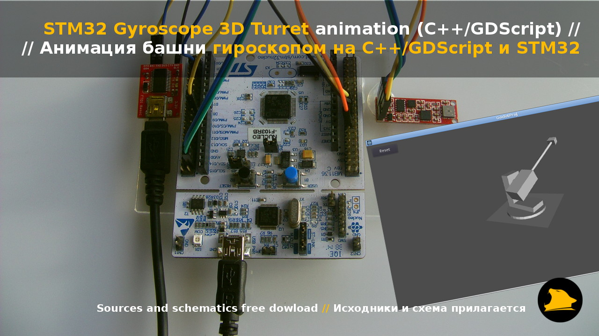

# STM32 Gyroscope 3D Turret animation

###How to...
1. Connect modules as shown on "Connection.png"
2. Flash firmware into MCU
3. Download from [here](https://yadi.sk/d/DL0kE1k933ecdX), unpack and run "godot.x11.tools.64" binary file on 64 bit Linux, or build from sources
4. Open project "GodotEngine Gyroscope Project" and run
5. Turret will rotate according to gyroscope rotation

###Project demo Video/Photo
- YouTube demo video URL: https://www.youtube.com/watch?v=04r14C_OQ1g
- Yandex Disk folder URL: https://yadi.sk/d/j7bRUsMP33dzxX
